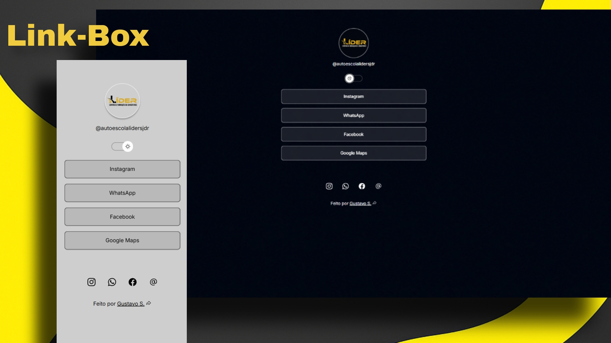

<h1 align="center"> Projeto Link-Box </h1>

 Produzido por Gustavo S.

  <a href="8-tecnologias">Tecnologias</a>&nbsp;&nbsp;&nbsp;|&nbsp;&nbsp;&nbsp;
  <a href="8-projeto">Projeto</a>&nbsp;&nbsp;&nbsp;|&nbsp;&nbsp;&nbsp;
  <a href="g-layout">Layout</a>&nbsp;&nbsp;&nbsp;|&nbsp;&nbsp;&nbsp;
  <a href="https://www.instagram.com/ghs_23i/">Contato</a>

 

 

## 🚀 Tecnologias

Esse projeto foi desenvolvido com as seguintes tecnologias:

- HTML & CSS
- JavaScript
- Git Github
- Figma

 

## 💻 Projeto

Um agregador de links usado como um cartão de visitas digital, perfeito para ser usado como a porta de entrada para seus negócios com todos os seus links em amostra para seu publico. 🖥️

 

## 📩 Contato

Você pode conversar com o criador através do
<a href="https://www.instagram.com/ghs_23i/">Instagram</a>, e la conhecer mais sobre ele e seus projetos. 💻
